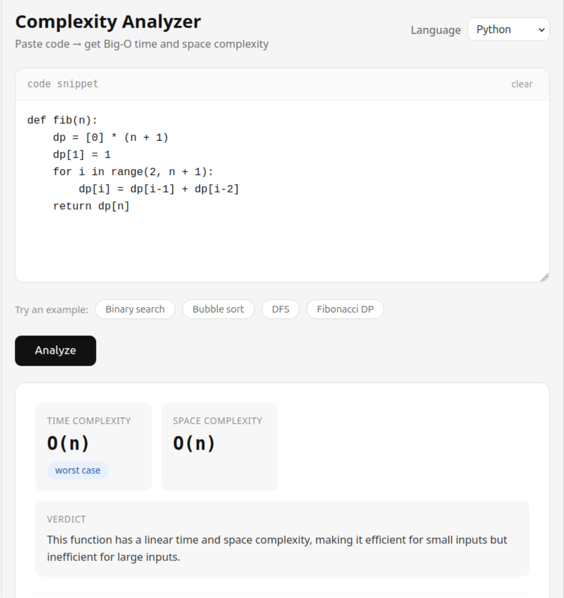
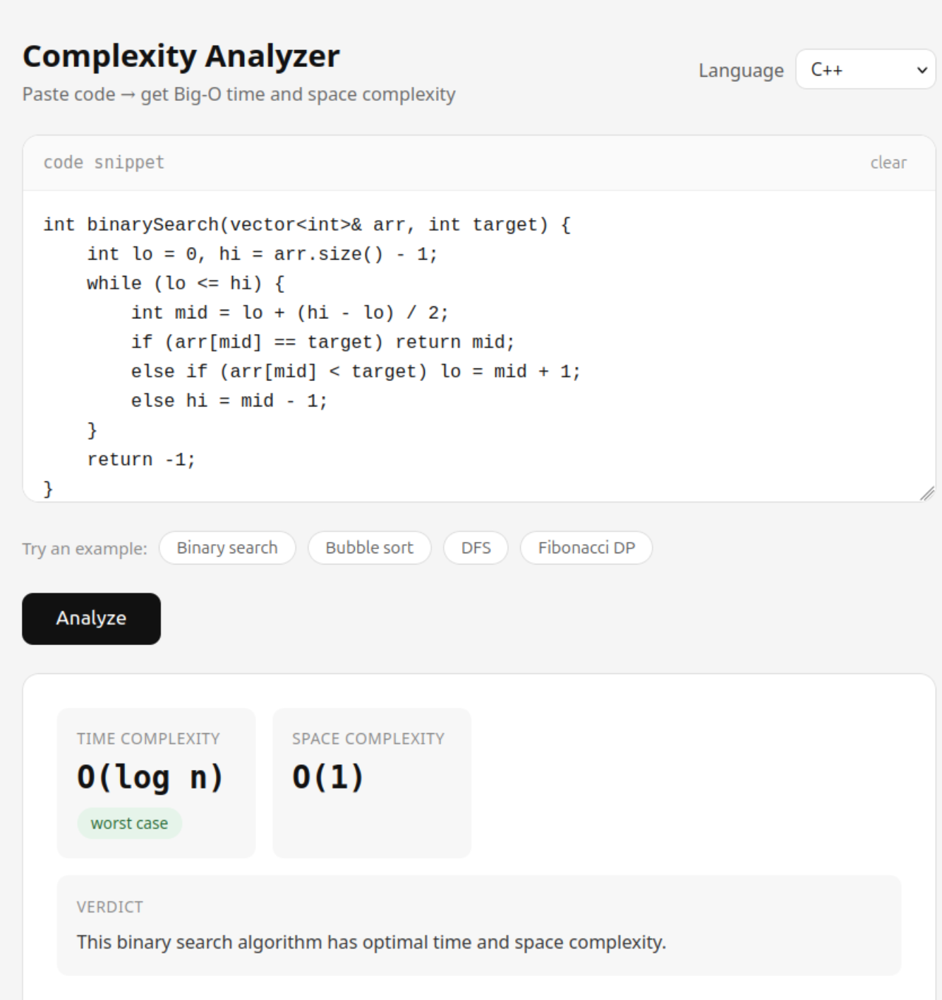

# Complexity-Analyzer

Paste any code snippet and instantly get its **time and space complexity**, a line-by-line breakdown, and an optimization tip  — powered by Claude AI.

----

## Features

- Analyzes time and space complexity for any code snippet
- Supports C++, Python, Java, and JavaScript
- Line-by-line breakdown of what contributes to the complexity
- Best / average / worst case labeling
- Concrete optimization tip for every analysis
- Clean, minimal UI  — no login, no setup for the user

----

## Screenshots



## Tech Stack

| Layer    | Technology          |
|----------|---------------------|
| Frontend | HTML, CSS, JS (vanilla) |
| Backend  | Python, Flask       |
| AI       | Anthropic Claude API (claude-sonnet) |
 
----

## Project Structure

```
complexity-analyzer/
├── index.html          # frontend — UI and fetch calls to Flask
├── server.py           # backend — Flask server, calls Anthropic API
├── requirements.txt    # Python dependencies
├── .env                # your API key (never committed)
├── .gitignore
├── README.md
└── examples/
    ├── sorting.cpp     # bubble sort, merge sort, quick sort
    ├── graphs.cpp      # BFS, DFS, Dijkstra's
    └── dp.py           # fibonacci, knapsack, LCS
```

---

## How it works

```
Browser (index.html)
    |
    | POST /analyze  { code, language }
    v
Flask server (server.py)
    |
    | calls Anthropic API with structured prompt
    v
Claude (claude-sonnet)
    |
    | returns JSON { time, space, breakdown, tip }
    v
Flask → Browser → renders result card
```

## License

MIT — free to use, modify, and distribute.
 

 

